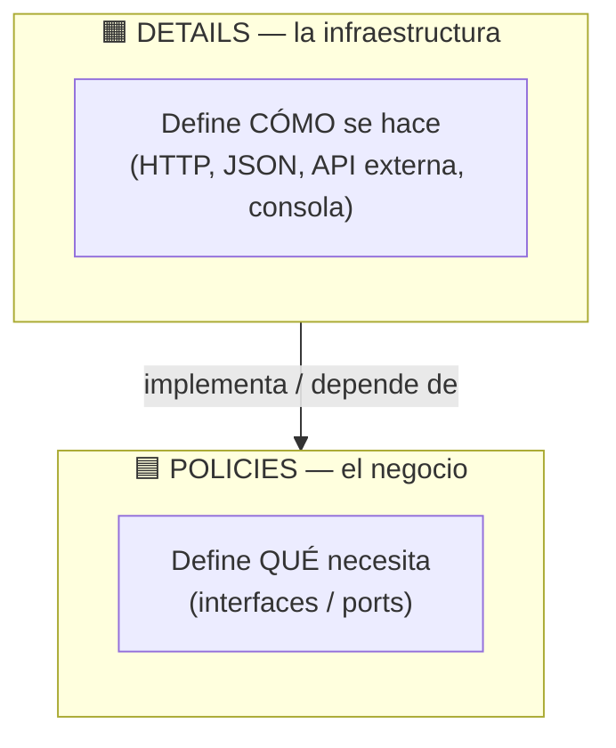
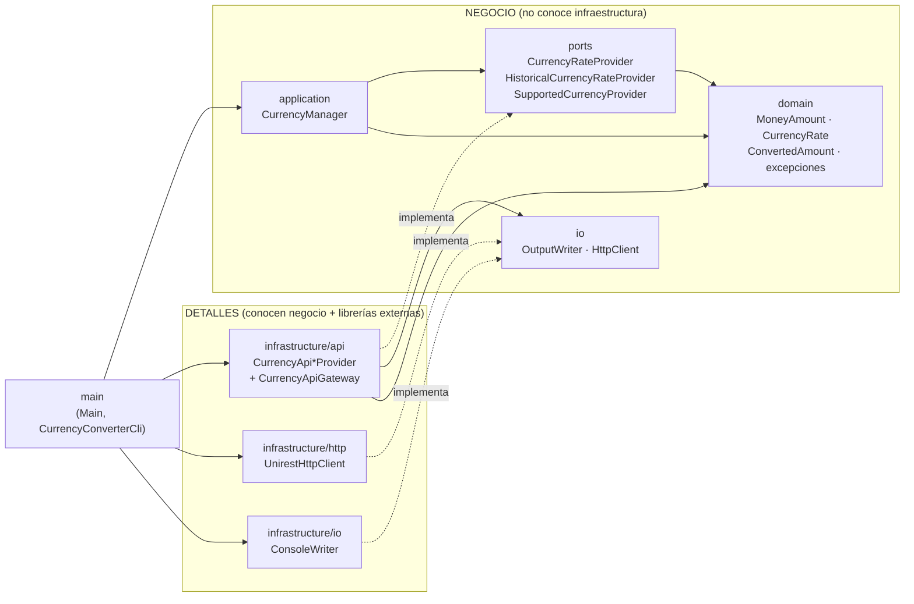
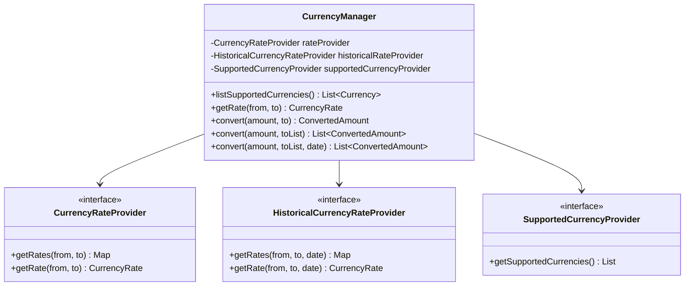
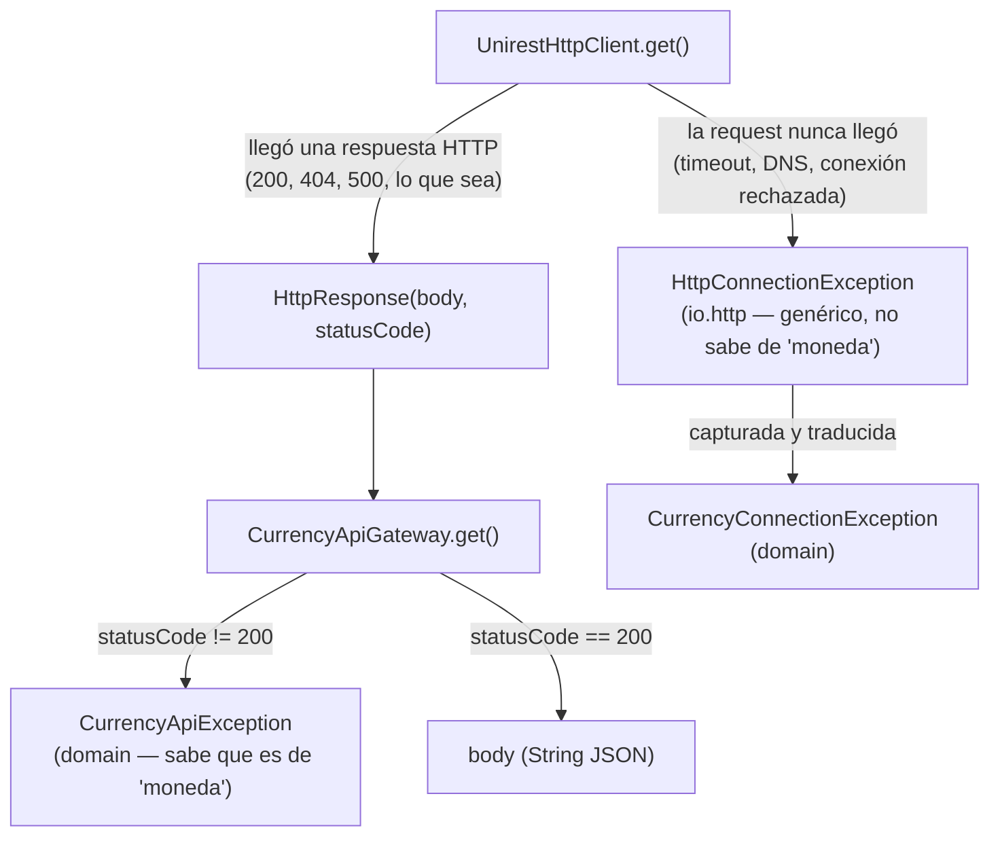
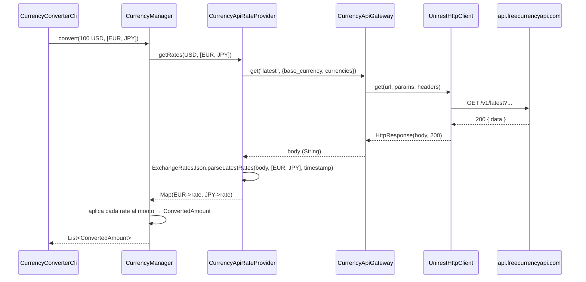
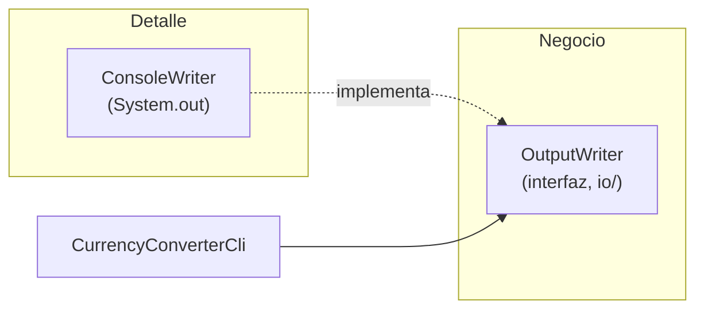
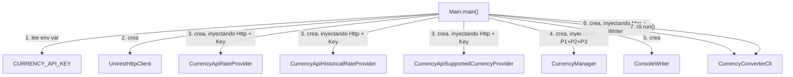

# Arquitectura del TP1 — Currency Converter

> Documento de referencia técnica para el Trabajo Práctico #1 de Desarrollo de
> Software Profesional (ITBA, 2026). Explica **qué se hizo**, **por qué se
> hizo así** y **cómo se comunican las capas entre sí**, con el nivel de
> detalle suficiente como para poder usarse como insumo/prompt para armar la
> presentación del TP.

---

## 1. Contexto y objetivo

El TP parte de un `CurrencyConverter` visto en clase (código con problemas:
paquetes inconsistentes, clases que no compilaban, manejo de errores nulo,
una API key commiteada) y pide agregar 7 funcionalidades nuevas manteniendo
dos requisitos no funcionales explícitos:

1. **Código limpio** (Clase 1: nombres buscables, métodos de una sola cosa,
   evitar duplicación).
2. **Separación entre negocio y detalles**, con **buen manejo de
   dependencias** (Clase 3: *Policies vs Details*, Dependency Inversion).
3. Cobertura de **unit tests del 100%**.

La consigna es explícita en que **no hace falta ninguna arquitectura
específica** (no es un TP de Clean Architecture "de libro", con capas de
`UseCases`, `Entities`, etc.) — sólo pide que el negocio no dependa de los
detalles. Lo que se armó es una arquitectura **liviana en capas**, con el
mismo principio rector que se vio en el ejemplo de `CesarCipher` de la
Clase 3: **el negocio define interfaces ("qué necesito"), y los detalles las
implementan ("cómo se hace")**.

---

## 2. El principio rector: Policies vs Details



Esto es la **Inversión de Dependencias** (la "D" de SOLID) aplicada
literalmente: las flechas de dependencia en el código **apuntan hacia el
negocio**, nunca al revés. `CurrencyManager` (el negocio) no importa
`Gson`, no importa `Unirest`, no sabe que existe `freecurrencyapi.com`. Sólo
conoce 3 interfaces (`ports`). Quien sí sabe todo eso son los adapters, que
viven en `infrastructure` y dependen del negocio (implementan sus
interfaces), no al revés.

Esta idea es la misma que resuelve los 3 problemas SOLID vistos en el caso
`Call` (OCP, ISP, LSP): en vez de una jerarquía de herencia rígida donde
todo vive en una clase padre, se usa **composición** — el negocio recibe sus
colaboradores (providers, writer) inyectados por constructor.

---

## 3. Estructura de paquetes

```
src/main/java/edu/itba/dps/tp1/exchange/
│
├── domain/                          ← Modelo de negocio (records inmutables)
│   ├── MoneyAmount.java             (moneda + monto, con redondeo)
│   ├── CurrencyRate.java            (rate + timestamp)
│   ├── ConvertedAmount.java         (resultado de una conversión + rate usada)
│   └── exception/
│       ├── CurrencyProviderException.java   (base abstracta)
│       ├── CurrencyConnectionException.java (no se pudo conectar)
│       ├── CurrencyApiException.java        (la API respondió con error, ej. 404/500)
│       └── CurrencyNotAvailableException.java (la API no tiene esa moneda)
│
├── ports/                           ← Interfaces que el NEGOCIO define
│   ├── CurrencyRateProvider.java            (cotización actual)
│   ├── HistoricalCurrencyRateProvider.java  (cotización a fecha pasada)
│   └── SupportedCurrencyProvider.java       (catálogo de monedas soportadas)
│
├── io/                               ← Puertos técnicos genéricos (no saben de "moneda")
│   ├── OutputWriter.java             (dónde se escribe un resultado)
│   └── http/
│       ├── HttpClient.java           (puerto de transporte HTTP)
│       ├── HttpResponse.java
│       └── HttpConnectionException.java
│
├── application/                     ← Orquestación del negocio
│   └── CurrencyManager.java          (Facade: único punto de entrada)
│
├── infrastructure/                  ← DETAILS: todo lo concreto
│   ├── http/
│   │   └── UnirestHttpClient.java    (implementa HttpClient con Unirest)
│   ├── api/
│   │   ├── CurrencyApiGateway.java          (paquete-privado: ejecuta el GET + traduce errores)
│   │   ├── ExchangeRatesJson.java           (paquete-privado: parsea /latest y /historical)
│   │   ├── CurrencyApiRateProvider.java     (implementa CurrencyRateProvider)
│   │   ├── CurrencyApiHistoricalRateProvider.java (implementa HistoricalCurrencyRateProvider)
│   │   └── CurrencyApiSupportedCurrencyProvider.java (implementa SupportedCurrencyProvider)
│   └── io/
│       └── ConsoleWriter.java        (implementa OutputWriter con System.out)
│
└── main/                            ← Composition root
    ├── Main.java                     (arma todo, único lugar con detalles concretos)
    └── CurrencyConverterCli.java     (demo de las 7 funcionalidades, 100% testeable)
```

**Regla de oro que se respetó en cada paquete:** nada dentro de `domain`,
`ports`, `io` o `application` importa una clase de `infrastructure`. Las
flechas de import sólo van de `infrastructure`/`main` hacia adentro, nunca
al revés.

---

## 4. Diagrama de dependencias entre capas



Notar que las flechas punteadas (`-. implementa .->`) son las únicas que
"cruzan" hacia el negocio, y son exactamente las relaciones de
implementación de interfaz — el mecanismo de Dependency Inversion. Todas
las demás dependencias de `infrastructure` apuntan hacia `domain`/`ports`
(negocio), nunca al revés.

---

## 5. Los `ports`: por qué son 3 interfaces chicas y no una sola

En el caso de estudio de SOLID visto en clase (`Call`), el problema #2 era
**ISP violado**: una interfaz gorda obligaba a cada subclase a implementar
métodos que no le servían (`isLocal()`, `isNational()`, `isInternational()`
devolviendo `false` la mayoría de las veces).

Para no repetir ese error, en vez de un único `CurrencyRateProvider` con 5
métodos (cotización actual, cotización histórica, catálogo, conversión
simple, conversión batch), se armaron **3 interfaces**, cada una con **una
sola responsabilidad**:

| Interfaz | Responsabilidad | Quién la implementa |
|---|---|---|
| `CurrencyRateProvider` | Cotización actual (single + batch) | `CurrencyApiRateProvider` |
| `HistoricalCurrencyRateProvider` | Cotización a una fecha pasada | `CurrencyApiHistoricalRateProvider` |
| `SupportedCurrencyProvider` | Listado de monedas soportadas | `CurrencyApiSupportedCurrencyProvider` |

Además, cada interfaz **evita la duplicación** con un método `default`: el
caso "cotización de un solo par" se resuelve llamando al caso batch con una
lista de un elemento. Así el adapter sólo tiene que implementar **un solo
método abstracto** (`getRates`), no dos:

```java
public interface CurrencyRateProvider {
    Map<Currency, CurrencyRate> getRates(Currency from, List<Currency> to);

    default CurrencyRate getRate(Currency from, Currency to) {
        return getRates(from, List.of(to)).get(to);
    }
}
```

Esto también resuelve de una sola vez las consignas **#3** (cotización
sola), **#5** (conversión a múltiples monedas) y **#7** (mostrar la
cotización usada): todas pasan por el mismo método `getRates`.

---

## 6. `CurrencyManager`: el Facade único

`Main` no debería tener que conocer 3 providers distintos para armar la
aplicación. Por eso `CurrencyManager` (capa `application`) actúa como
**Facade**: es la única clase que `Main` necesita instanciar para acceder a
todo el negocio.



**Por qué es un Facade válido y no una violación de SRP:** `CurrencyManager`
no tiene lógica de negocio propia más allá de transformar una `CurrencyRate`
en un `ConvertedAmount` (aplicar el rate al monto). No decide *cómo* se
consigue una cotización, ni *cómo* se llama a la API — sólo **delega y
combina**. Su única razón de cambio es "la forma en que se expone la
capacidad de conversión de moneda", no las reglas de conversión en sí.

---

## 7. Los `details`: infraestructura HTTP y API externa

### 7.1. Dos niveles de puertos HTTP

Hay una distinción importante entre dos tipos de error que puede devolver
una llamada HTTP, y cada uno se modela en la capa que le corresponde:



- `HttpClient`/`HttpConnectionException` (paquete `io.http`) son **genéricos**:
  no mencionan monedas, podrían reutilizarse para llamar a cualquier otra
  API el día de mañana.
- `CurrencyApiGateway` es quien **traduce** esos conceptos genéricos de
  transporte a las excepciones de dominio (`CurrencyConnectionException`,
  `CurrencyApiException`) — es el punto exacto donde se resuelve la
  consigna **#4** (manejar y notificar errores de conexión o de la API de
  forma clara).

### 7.2. Por qué existe `CurrencyApiGateway` y `ExchangeRatesJson`

Los 3 adapters (`CurrencyApiRateProvider`, `CurrencyApiHistoricalRateProvider`,
`CurrencyApiSupportedCurrencyProvider`) necesitan **lo mismo** tres veces:
armar la URL con el API key, ejecutar el GET, chequear el status code y
convertirlo en la excepción correcta. En vez de repetir eso en cada uno
(la Clase 1 es clara: *"la duplicación es el origen de todos los
males"*), esa lógica vive en una única clase de paquete `infrastructure/api`:

- **`CurrencyApiGateway`** (paquete-privada, nadie fuera de `infrastructure.api`
  la ve): ejecuta el GET contra `api.freecurrencyapi.com/v1/...` y traduce
  errores de transporte/HTTP a excepciones de dominio.
- **`ExchangeRatesJson`** (paquete-privada): conoce las dos formas de respuesta
  de FreeCurrencyAPI: `/latest` devuelve `{"data":{"CODE": rate}}` y
  `/historical` devuelve `{"data":{"YYYY-MM-DD":{"CODE": rate}}}`. La
  conversión común de esos valores a `CurrencyRate` se comparte entre
  `CurrencyApiRateProvider` y `CurrencyApiHistoricalRateProvider`.



---

## 8. Manejo de errores (consigna #4)

```mermaid
classDiagram
    class CurrencyProviderException {
        <<abstract>>
    }
    class CurrencyConnectionException {
        No se pudo conectar al provider
        (timeout, DNS, conexión rechazada)
    }
    class CurrencyApiException {
        +int statusCode
        La API respondió con error
        (404, 500, etc.)
    }
    class CurrencyNotAvailableException {
        La API respondió 200 pero
        no incluyó la moneda pedida
    }
    CurrencyProviderException <|-- CurrencyConnectionException
    CurrencyProviderException <|-- CurrencyApiException
    CurrencyProviderException <|-- CurrencyNotAvailableException
```

Las tres son *unchecked* (extienden `RuntimeException` a través de la base),
a propósito: son errores de infraestructura externa que casi ningún
llamador de negocio puede "resolver" localmente, así que forzar un
`try/catch` en cada punto de uso (checked exceptions) sólo agregaría ruido.
Cualquier capa superior que sí necesite reaccionar puede capturar
`CurrencyProviderException` (el tipo base) o alguno de los tres casos
puntuales.

---

## 9. La salida (`OutputWriter`): mismo patrón que `Reader`/`Writer` de la Clase 3



`CurrencyConverterCli` (la clase que arma el mensaje "USD -> EUR rate:
0.86...") nunca llama a `System.out.println` directamente: escribe a través
de `OutputWriter.write(String)`. Hoy la implementación es `ConsoleWriter`,
pero mañana podría ser un `FileWriter`, un `InMemoryWriter` para tests, o
un adapter que mande el resultado a una UI — sin tocar una sola línea de
`CurrencyConverterCli`. Es exactamente el mismo mecanismo que el ejemplo de
`Reader`/`Writer` de `CesarCipher` visto en la Clase 3.

Es también lo que permite testear `CurrencyConverterCli` al 100% sin tocar
la consola real: en los tests se le pasa un `OutputWriter` de mentira
(`writtenMessages::add`, una simple lambda que junta los mensajes en una
lista) en vez de mockear `System.out`.

---

## 10. `Main`: el composition root



`Main` es la **única** clase de todo el proyecto que:
- Lee variables de entorno.
- Sabe que `UnirestHttpClient` y `ConsoleWriter` existen.
- Hace `new` de una clase concreta de `infrastructure`.

Todo lo demás recibe sus dependencias **por constructor** (constructor
injection manual, sin ningún framework de DI — no hace falta para este
tamaño de proyecto). Esto es lo que hace que `Main` quede excluido de la
regla de cobertura del 100% en `pom.xml`: no tiene lógica propia que
testear, sólo cableado.

---

## 11. Mapeo funcionalidad → clases responsables

| # | Funcionalidad pedida | Clases involucradas |
|---|---|---|
| 1 | Listar monedas soportadas | `SupportedCurrencyProvider` → `CurrencyApiSupportedCurrencyProvider` → `CurrencyManager.listSupportedCurrencies()` |
| 2 | Timestamp en la respuesta de conversión | `CurrencyRate.timestamp` (instante de consulta para tasas actuales; fecha solicitada a las 00:00 UTC para tasas históricas, porque FreeCurrencyAPI no devuelve un timestamp) |
| 3 | Cotización sin convertir un monto | `CurrencyRateProvider.getRate()` (default method) → `CurrencyManager.getRate()` |
| 4 | Manejo claro de errores de conexión/API | `CurrencyConnectionException`, `CurrencyApiException`, `CurrencyNotAvailableException`, traducidas en `CurrencyApiGateway` |
| 5 | Convertir un monto a múltiples monedas | `CurrencyRateProvider.getRates()` (batch) → `CurrencyManager.convert(amount, List<Currency>)` |
| 6 | Cotización histórica para varias monedas | `HistoricalCurrencyRateProvider` → `CurrencyManager.convert(amount, List<Currency>, LocalDate)` |
| 7 | Ver la cotización usada en cada resultado | `ConvertedAmount.rateUsed` |

---

## 12. Principios SOLID aplicados — resumen con ejemplos concretos

| Principio | Dónde se aplica | Cómo |
|---|---|---|
| **S**RP | `CurrencyManager` vs `CurrencyApiGateway` vs `ExchangeRatesJson` | Cada clase tiene una única razón de cambio: orquestar el negocio, ejecutar HTTP + traducir errores, y parsear JSON son 3 responsabilidades separadas en 3 clases. |
| **O**CP | `ports/*Provider` | Agregar un cuarto proveedor de cotizaciones (ej. otra API) no requiere tocar `CurrencyManager`: sólo se escribe una clase nueva que implemente la interfaz. |
| **L**SP | Todos los adapters de `infrastructure/api` | Cualquier implementación de `CurrencyRateProvider` es 100% intercambiable por otra sin romper a `CurrencyManager` — a diferencia del caso `Call`, acá no hay comportamiento que "cambie de significado" entre implementaciones. |
| **I**SP | 3 interfaces en `ports/` en vez de 1 | Un futuro consumidor que sólo necesite "listar monedas" depende únicamente de `SupportedCurrencyProvider`, no de los métodos de cotización que no usa. |
| **D**IP | Toda la capa `application` | `CurrencyManager` depende de abstracciones (`ports`), nunca de `infrastructure`. Las flechas de dependencia van de los detalles hacia el negocio (ver diagrama de la sección 4). |

---

## 13. Testing: cómo se llegó a 100% de cobertura de líneas y ramas

| Tipo de clase | Estrategia de test |
|---|---|
| `domain` (records) | Tests directos: constructor, validaciones, `equals`/`hashCode`/`toString` (los records generan estos métodos y JaCoCo los cuenta como líneas a cubrir). |
| `ports` (interfaces con `default`) | Se instancia una implementación mínima (lambda) sólo para poder ejercitar el método `default`. |
| `application.CurrencyManager` | Mockito mockeando los 3 `ports` — no toca red. |
| `infrastructure.http.UnirestHttpClient` | Un `com.sun.net.httpserver.HttpServer` embebido (de la JDK, sin dependencias nuevas) para el caso de éxito, y un puerto inalcanzable (`localhost:1`) para forzar el caso de fallo de conexión real. |
| `infrastructure.api.*` | Mockito mockeando `HttpClient`, alimentando **JSON real** capturado con `curl` contra la API de verdad como fixture de los tests. |
| `infrastructure.io.ConsoleWriter` | Se redirige `System.out` a un `ByteArrayOutputStream` temporalmente. |
| `main.CurrencyConverterCli` | Mockito mockea `CurrencyManager`; el `OutputWriter` es una lambda que junta los mensajes en una lista para poder hacer asserts sobre ellos. |
| `main.Main` | **Excluido** de la regla de cobertura en `pom.xml` — es el composition root, no tiene lógica propia, y probarlo de verdad implicaría pegarle a la red real desde un unit test. |

Resultado real de `mvn verify`: **41 tests, 0 fallos, 100% de líneas y
ramas cubiertas** (fuera de `Main`).

---

## 14. Decisiones de diseño y alternativas descartadas

- **¿Por qué no separar `CurrencyManager` en dos clases (conversión vs
  catálogo)?** Se evaluó, pero el usuario pidió explícitamente un único
  Facade para que `Main` sólo dependa de un objeto. Es una decisión
  razonable: las 5 operaciones giran todas alrededor del mismo concepto de
  negocio ("exchange de monedas"), y `CurrencyManager` no mezcla reglas de
  negocio de ambos mundos — sólo delega.
- **¿Por qué no Clean Architecture completa (UseCases, Entities,
  Interactors)?** La consigna del TP dice explícitamente que no hace falta
  ninguna arquitectura específica, sólo separar negocio de detalles. Meter
  una capa de `UseCases` por cada una de las 7 funcionalidades hubiera sido
  sobre-ingeniería para el tamaño del problema.
- **¿Por qué la API key sale por variable de entorno y no por archivo de
  config?** Es la opción que menos fricción agrega (no hay que gestionar un
  archivo adicional ni cuidar que no se suba a git) y es el estándar de
  facto para credenciales en apps chicas/CLI.
- **¿Por qué se usa `freecurrencyapi.com`?** Es el proveedor requerido por la
  consigna. Los adapters respetan sus contratos `/v1/currencies`, `/v1/latest`
  y `/v1/historical`; la API key se envía en el header `apikey`.

---

## 15. Cómo correr el proyecto

```bash
export CURRENCY_API_KEY="tu-api-key-de-freecurrencyapi.com"
mvn verify        # compila, corre los 41 tests, chequea 100% de cobertura
mvn exec:java -Dexec.mainClass="edu.itba.dps.tp1.exchange.main.Main"
```

(El usuario de este TP no tiene Java instalado localmente — la
compilación, los tests y la corrida end-to-end contra la API real ya
fueron verificados en el entorno de trabajo de la IA antes de la entrega.)
